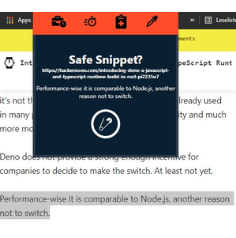

# First chrome extension

4 features: Tracker, Break, Snippet-Safer, Color-Picker

Most relevant and essential feature is the Snippet-Safer.\
While reading articles, blogs, coding stuff I just want to save some text or code snippets,
and maybe later go through it and store it with Notion. So I can select a piece of text, open the extension, click safe and
than open the HTML-page, where I list all snippets with the href.
Can of course delete each snippet.\
Also possible to get this done with keyboard shortcuts. _Ctrl+Shift+4_

The intension for the tracker feature was to record mainly my sport times.
I also record the coding time. but the priority is the sport as a reminder not to forget it.
So I can start and stop the recording and with SVG I created a simple bar chart to visualize it.

The break feature is just for having a break.

For the color picker I just was interested to get my plan working.
I make a Screenshot, get the mouse x and y coordinates, and calculate with Canvas API getImageData() the rgb value. The result with the corresponding hex value I show in the extension.\
keyboard shortcut: _Ctrl+Shift+3_

### Stack

-   Chrome extension
-   React
-   React Context API
-   SVG

### Get it working

-   clone repository
-   yarn install
-   yarn build
-   go to chrome://extensions/
-   unpack the build folder as an extension
